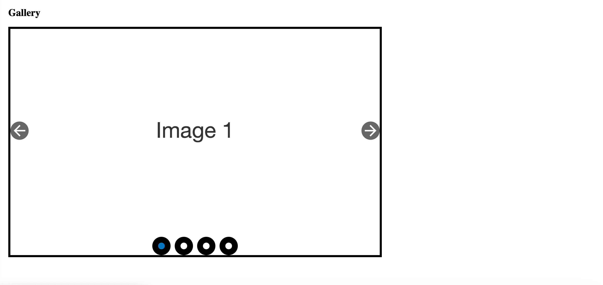
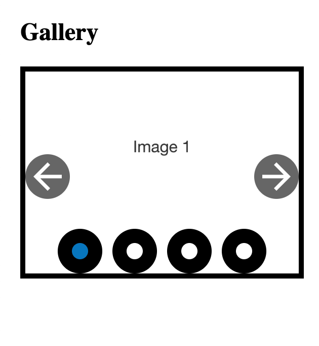

# Accessible Image Gallery Slider

A lightweight, accessible image gallery slider built with **vanilla JavaScript** — no dependencies, mobile-ready, and easy to drop into any project.

---

## Features

- Pure JavaScript (no frameworks)
- Keyboard and button navigation
- Keyboard and simple pointer operable controls
- WCAG 2.2 AA conformant 
- Easy to customize and extend

---

## Screenshots

### Desktop


### Mobile 


---

## Usage

### HTML
```html
<div id="gallery-container" class="gallery-container">
  
  
  
  
  <div class="next-prev-controls">
    <button id="prev" aria-label="Previous image">←</button>
    <button id="next" aria-label="Next image">→</button>
  </div>
</div>